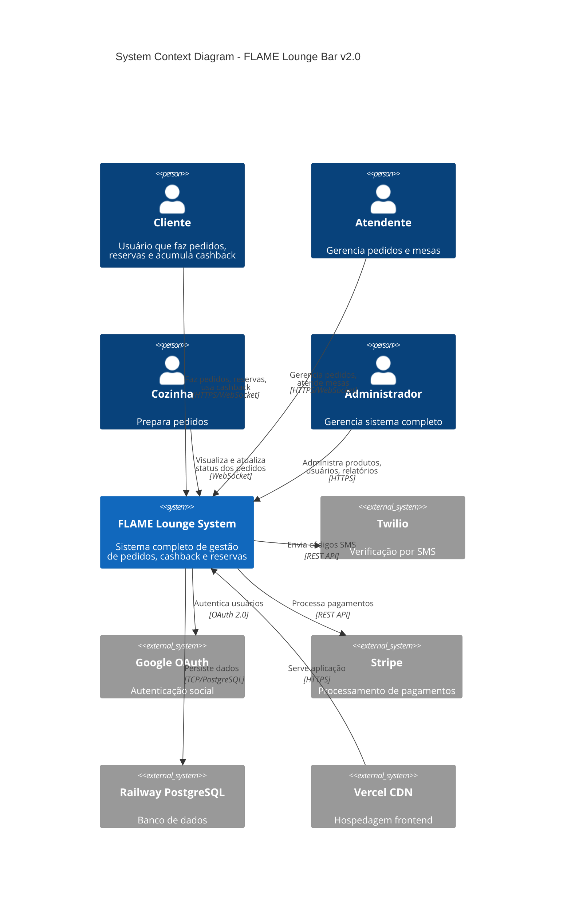
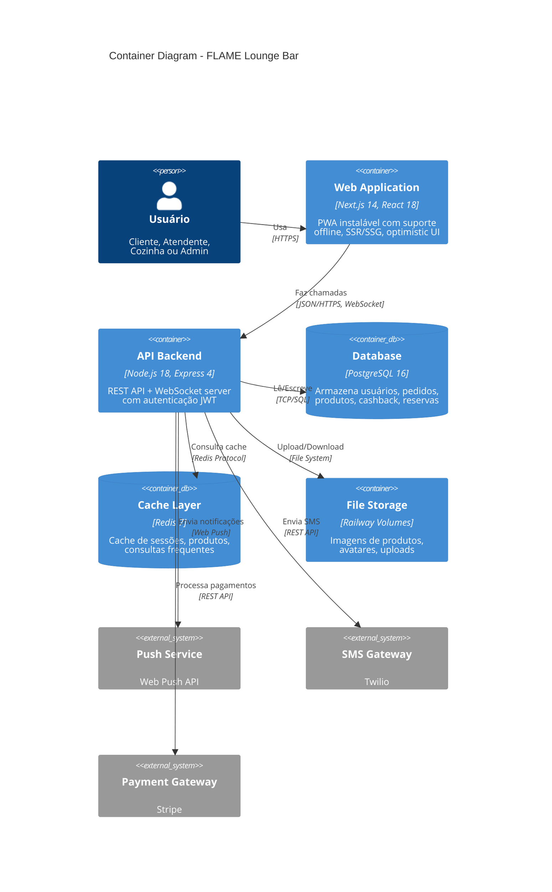
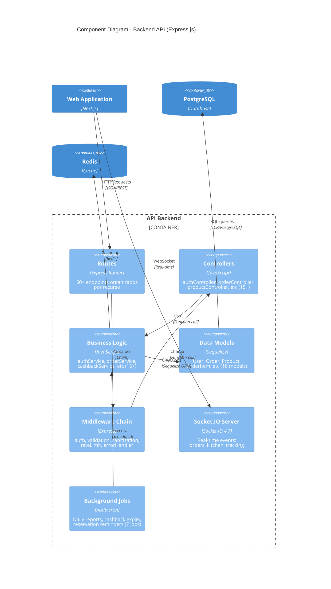
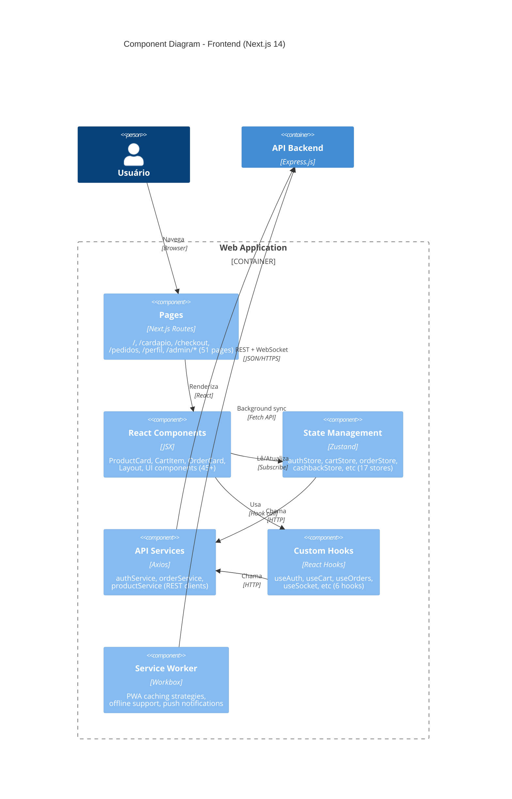
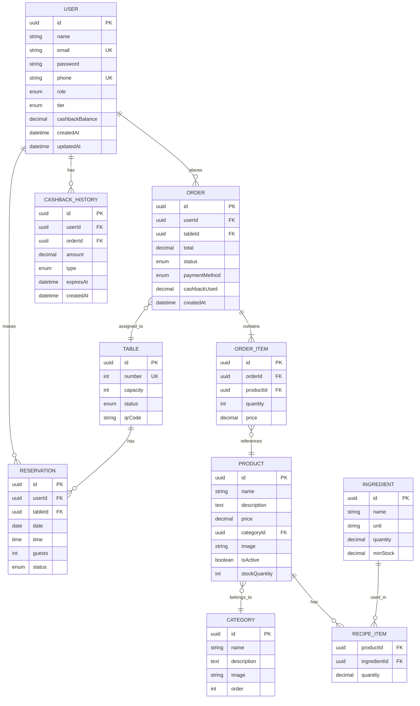
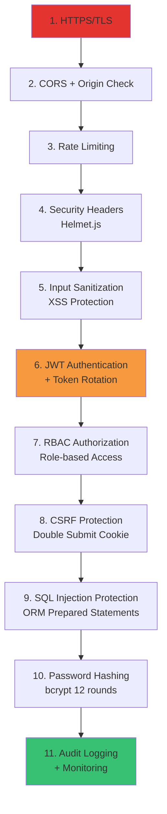
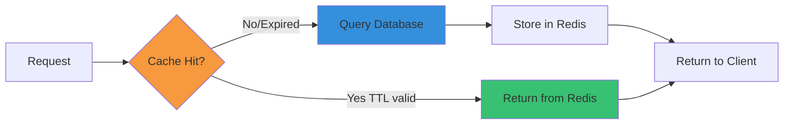
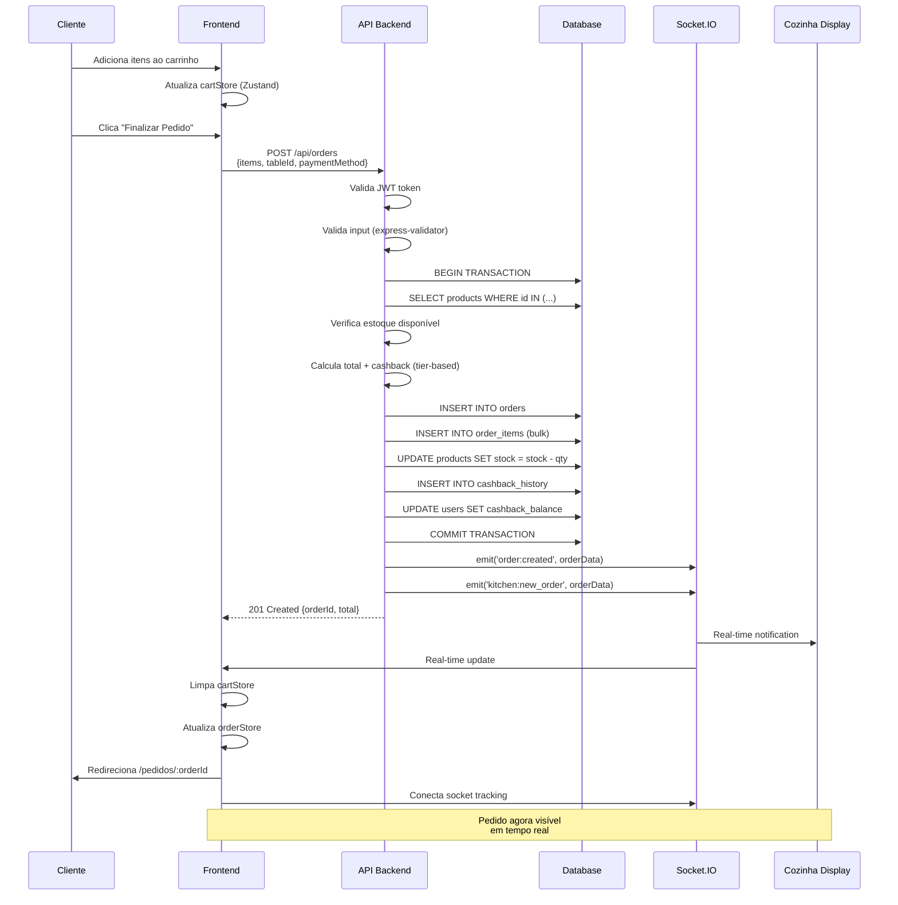
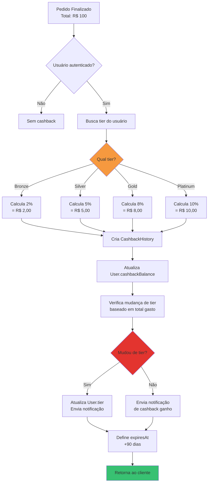

# 🏗️ ARQUITETURA TÉCNICA - FLAME LOUNGE

**Versão:** 2.0
**Última Atualização:** 2026-01-16
**Status:** Produção

---

## 📋 Índice

- [Visão Geral](#visão-geral)
- [Arquitetura de Alto Nível](#arquitetura-de-alto-nível)
- [Stack Tecnológico](#stack-tecnológico)
- [Frontend Architecture](#frontend-architecture)
- [Backend Architecture](#backend-architecture)
- [Database Architecture](#database-architecture)
- [Real-time Communication](#real-time-communication)
- [Security Architecture](#security-architecture)
- [Deployment Architecture](#deployment-architecture)
- [Fluxos de Dados](#fluxos-de-dados)
- [Decisões Arquiteturais](#decisões-arquiteturais)

---

## 🎯 Visão Geral

O FLAME Lounge é uma aplicação **full-stack moderna** construída com arquitetura **cliente-servidor** separada, comunicação **real-time** via WebSockets, e design **mobile-first** com suporte PWA.

### Características Principais

- ✅ **Separação Front/Back** - Deploys independentes
- ✅ **Real-time** - Socket.io para updates instantâneos
- ✅ **Progressive Web App** - Instalável e funciona offline
- ✅ **RESTful API** - Arquitetura baseada em recursos
- ✅ **Autenticação JWT** - Stateless e escalável
- ✅ **Database ORM** - Sequelize com migrações versionadas

---

## 🏛️ Arquitetura de Alto Nível

```
┌─────────────────────────────────────────────────────────────────┐
│                        CAMADA DE USUÁRIOS                        │
├─────────────┬─────────────┬──────────────┬─────────────────────┤
│   Clientes  │   Garçons   │   Cozinha    │   Administradores   │
│  (Mobile)   │  (Tablet)   │   (KDS)      │    (Desktop)        │
└─────────────┴─────────────┴──────────────┴─────────────────────┘
                              ▼
┌─────────────────────────────────────────────────────────────────┐
│                         LOAD BALANCER                            │
│                    (Vercel Edge Network)                         │
└─────────────────────────────────────────────────────────────────┘
                              ▼
┌─────────────────────────────────────────────────────────────────┐
│                      FRONTEND (Next.js 14)                       │
├─────────────────────────────────────────────────────────────────┤
│  • SSR/SSG Pages (50+ routes)                                   │
│  • React Components (45+)                                        │
│  • Zustand State Management (17 stores)                         │
│  • Service Worker (PWA)                                          │
│  • Socket.io Client (Real-time)                                 │
└─────────────────────────────────────────────────────────────────┘
                              ▼
                    ┌─────────────────┐
                    │   API Gateway   │
                    │  (Express.js)   │
                    └─────────────────┘
                              ▼
┌─────────────────────────────────────────────────────────────────┐
│                      BACKEND (Express.js)                        │
├─────────────────────────────────────────────────────────────────┤
│  ┌──────────────┐  ┌──────────────┐  ┌──────────────┐         │
│  │  Controllers │  │   Services   │  │     Jobs     │         │
│  │    (API)     │  │  (Business)  │  │  (Cron)      │         │
│  └──────────────┘  └──────────────┘  └──────────────┘         │
│         ▼                  ▼                  ▼                  │
│  ┌──────────────┐  ┌──────────────┐  ┌──────────────┐         │
│  │     Auth     │  │    Socket    │  │  Webhooks    │         │
│  │ Middleware   │  │   Handler    │  │   (Stripe)   │         │
│  └──────────────┘  └──────────────┘  └──────────────┘         │
└─────────────────────────────────────────────────────────────────┘
                              ▼
┌─────────────────────────────────────────────────────────────────┐
│                    DATA ACCESS LAYER (ORM)                       │
├─────────────────────────────────────────────────────────────────┤
│  Sequelize ORM • 18 Models • Migrations • Associations          │
└─────────────────────────────────────────────────────────────────┘
                              ▼
┌─────────────────────────────────────────────────────────────────┐
│                     DATABASE (PostgreSQL)                        │
├─────────────────────────────────────────────────────────────────┤
│  Railway • Primary + Replica • Automated Backups                │
└─────────────────────────────────────────────────────────────────┘
                              ▼
┌─────────────────────────────────────────────────────────────────┐
│                      EXTERNAL SERVICES                           │
├──────────────┬──────────────┬──────────────┬──────────────────┤
│    Stripe    │   SendGrid   │    Twilio    │   Cloudinary     │
│  (Payments)  │   (Email)    │    (SMS)     │   (Images)       │
└──────────────┴──────────────┴──────────────┴──────────────────┘
```

---

## 🛠️ Stack Tecnológico

### Frontend Stack

```
┌────────────────────────────────────────────┐
│           PRESENTATION LAYER               │
├────────────────────────────────────────────┤
│ Next.js 14.0.4 (React 18.2.0)             │
│ • App Router                               │
│ • SSR/SSG/ISR                              │
│ • Image Optimization                       │
│ • API Routes (if needed)                   │
└────────────────────────────────────────────┘
              ▼
┌────────────────────────────────────────────┐
│           STATE MANAGEMENT                 │
├────────────────────────────────────────────┤
│ Zustand 4.4.7                              │
│ • authStore                                │
│ • cartStore                                │
│ • orderStore                               │
│ • ... (17 stores total)                    │
└────────────────────────────────────────────┘
              ▼
┌────────────────────────────────────────────┐
│           DATA FETCHING                    │
├────────────────────────────────────────────┤
│ React Query 3.39.3 + Axios 1.6.2           │
│ • Caching                                  │
│ • Retry logic                              │
│ • Optimistic updates                       │
└────────────────────────────────────────────┘
              ▼
┌────────────────────────────────────────────┐
│              UI LAYER                      │
├────────────────────────────────────────────┤
│ Tailwind CSS 3.3.6                         │
│ • Utility-first                            │
│ • Responsive breakpoints                   │
│ • Custom design tokens                     │
│                                            │
│ Component Libraries:                       │
│ • Heroicons 2.0.18                         │
│ • Lucide React 0.544.0                     │
│ • Framer Motion 10.16.16                   │
└────────────────────────────────────────────┘
```

### Backend Stack

```
┌────────────────────────────────────────────┐
│           API LAYER                        │
├────────────────────────────────────────────┤
│ Express.js 4.18.2                          │
│ • RESTful routes (~20)                     │
│ • Middleware chain                         │
│ • Error handling                           │
└────────────────────────────────────────────┘
              ▼
┌────────────────────────────────────────────┐
│       AUTHENTICATION & SECURITY            │
├────────────────────────────────────────────┤
│ JWT (jsonwebtoken 9.0.2)                   │
│ bcryptjs 2.4.3                             │
│ Helmet 7.1.0                               │
│ express-rate-limit 7.1.5                   │
│ CORS                                       │
└────────────────────────────────────────────┘
              ▼
┌────────────────────────────────────────────┐
│         BUSINESS LOGIC                     │
├────────────────────────────────────────────┤
│ Services (16 modules)                      │
│ • OrderService                             │
│ • PaymentService                           │
│ • CashbackService                          │
│ • ... etc                                  │
└────────────────────────────────────────────┘
              ▼
┌────────────────────────────────────────────┐
│           DATA LAYER                       │
├────────────────────────────────────────────┤
│ Sequelize 6.35.2                           │
│ • Models (18)                              │
│ • Migrations (15)                          │
│ • Associations                             │
│ • Validations                              │
└────────────────────────────────────────────┘
```

---

## 💻 Frontend Architecture

### Estrutura de Diretórios

```
frontend/src/
├── pages/                    # Next.js Routes (51 pages)
│   ├── index.js             # Landing page
│   ├── cardapio/            # Menu pages
│   ├── pedidos/             # Orders
│   ├── reservas/            # Reservations
│   ├── admin/               # Admin dashboard
│   └── staff/               # Staff area
│
├── components/              # React Components (45+)
│   ├── Admin/              # Admin components
│   ├── Auth/               # Login, Register
│   ├── Cart/               # Shopping cart
│   ├── Checkout/           # Payment flow
│   ├── Landing/            # Home page
│   ├── Menu/               # Menu display
│   ├── Tracking/           # Order tracking
│   └── ui/                 # Base components (Button, Input, etc)
│
├── stores/                  # Zustand Stores (17)
│   ├── authStore.js        # Authentication state
│   ├── cartStore.js        # Shopping cart
│   ├── orderStore.js       # Orders
│   ├── reservationStore.js # Reservations
│   └── ...
│
├── hooks/                   # Custom React Hooks (6)
│   ├── useAuth.js
│   ├── useCart.js
│   ├── useSocket.js
│   └── ...
│
├── services/                # API Clients
│   ├── api.js              # Axios instance
│   ├── authService.js
│   ├── orderService.js
│   └── ...
│
├── utils/                   # Utilities
│   ├── formatters.js
│   ├── validators.js
│   └── constants.js
│
└── styles/                  # Global styles
    ├── globals.css
    └── tailwind.config.js
```

### Component Architecture

```
┌─────────────────────────────────────────────────┐
│              PAGE COMPONENT                     │
│  (Next.js Route - SSR/SSG)                      │
├─────────────────────────────────────────────────┤
│  • Data fetching (getServerSideProps)           │
│  • SEO metadata                                 │
│  • Layout composition                           │
└─────────────────────────────────────────────────┘
                    ▼
┌─────────────────────────────────────────────────┐
│          CONTAINER COMPONENTS                   │
│  (Business Logic)                               │
├─────────────────────────────────────────────────┤
│  • Zustand stores connection                    │
│  • React Query hooks                            │
│  • Event handlers                               │
│  • State management                             │
└─────────────────────────────────────────────────┘
                    ▼
┌─────────────────────────────────────────────────┐
│        PRESENTATIONAL COMPONENTS                │
│  (Pure UI)                                      │
├─────────────────────────────────────────────────┤
│  • Props-based                                  │
│  • No business logic                            │
│  • Reusable                                     │
│  • Styled with Tailwind                         │
└─────────────────────────────────────────────────┘
```

### State Management (Zustand)

```javascript
// Example: cartStore.js
┌─────────────────────────────────────┐
│         CART STORE                  │
├─────────────────────────────────────┤
│ State:                              │
│  • items: []                        │
│  • total: 0                         │
│  • isOpen: false                    │
│                                     │
│ Actions:                            │
│  • addItem(product, quantity)       │
│  • removeItem(productId)            │
│  • updateQuantity(id, qty)          │
│  • clearCart()                      │
│  • openCart() / closeCart()         │
└─────────────────────────────────────┘
```

---

## 🔧 Backend Architecture

### Estrutura de Diretórios

```
backend/src/
├── models/                  # Sequelize Models (18)
│   ├── User.js
│   ├── Product.js
│   ├── Order.js
│   ├── OrderItem.js
│   └── ...
│
├── controllers/             # Request Handlers (~15)
│   ├── authController.js
│   ├── orderController.js
│   ├── productController.js
│   └── ...
│
├── services/                # Business Logic (16)
│   ├── authService.js
│   ├── orderService.js
│   ├── paymentService.js
│   ├── cashbackService.js
│   └── ...
│
├── routes/                  # Express Routes (~20)
│   ├── index.js            # Route aggregator
│   ├── auth.js
│   ├── orders.js
│   ├── products.js
│   └── ...
│
├── middlewares/             # Middleware Chain
│   ├── auth.js             # JWT verification
│   ├── validate.js         # Input validation
│   ├── errorHandler.js
│   └── rateLimit.js
│
├── migrations/              # Database Migrations (15)
│   ├── 001-create-users.js
│   ├── 002-create-products.js
│   └── ...
│
├── jobs/                    # Scheduled Tasks (7)
│   ├── stockAlerts.js
│   ├── reservationReminders.js
│   ├── cashbackExpiry.js
│   └── ...
│
├── database/                # DB Configuration
│   ├── config.js
│   └── connection.js
│
├── utils/                   # Helpers
│   ├── logger.js
│   ├── qrcode.js
│   └── notifications.js
│
└── server.js                # Entry Point
```

### Request Flow

```
1. HTTP Request
        ▼
2. Rate Limiting Middleware
        ▼
3. CORS Middleware
        ▼
4. Body Parser
        ▼
5. Route Matching
        ▼
6. Auth Middleware (if protected)
        ▼
7. Validation Middleware
        ▼
8. Controller
        ▼
9. Service (Business Logic)
        ▼
10. Model (Database)
        ▼
11. Response
```

### API Architecture (RESTful)

```
┌────────────────────────────────────────────────┐
│              REST API ENDPOINTS                │
├────────────────────────────────────────────────┤
│                                                │
│ /api/auth                                      │
│  ├─ POST   /register                          │
│  ├─ POST   /login                             │
│  ├─ POST   /refresh                           │
│  └─ POST   /logout                            │
│                                                │
│ /api/products                                  │
│  ├─ GET    /                                  │
│  ├─ GET    /:id                               │
│  ├─ POST   /           (admin)                │
│  ├─ PUT    /:id        (admin)                │
│  └─ DELETE /:id        (admin)                │
│                                                │
│ /api/orders                                    │
│  ├─ GET    /                                  │
│  ├─ GET    /:id                               │
│  ├─ POST   /                                  │
│  ├─ PATCH  /:id/status                        │
│  └─ DELETE /:id                               │
│                                                │
│ /api/reservations                              │
│  ├─ GET    /                                  │
│  ├─ GET    /:id                               │
│  ├─ POST   /                                  │
│  ├─ PATCH  /:id                               │
│  └─ DELETE /:id                               │
│                                                │
│ /api/cashback                                  │
│  ├─ GET    /balance                           │
│  ├─ GET    /history                           │
│  └─ POST   /redeem                            │
│                                                │
│ ... (20+ routes total)                         │
└────────────────────────────────────────────────┘
```

---

## 🗄️ Database Architecture

### Entity Relationship Diagram

```
┌─────────────┐         ┌──────────────┐         ┌─────────────┐
│    User     │◄────────┤    Order     │────────►│   Table     │
├─────────────┤  1:N    ├──────────────┤   N:1   ├─────────────┤
│ id          │         │ id           │         │ id          │
│ name        │         │ userId       │         │ number      │
│ email       │         │ tableId      │         │ capacity    │
│ password    │         │ total        │         │ status      │
│ phone       │         │ status       │         │ qrCode      │
│ role        │         │ createdAt    │         └─────────────┘
│ tier        │         └──────────────┘
│ cashback    │               │
└─────────────┘               │ 1:N
       │                      ▼
       │               ┌──────────────┐         ┌─────────────┐
       │               │  OrderItem   │────────►│   Product   │
       │               ├──────────────┤   N:1   ├─────────────┤
       │               │ id           │         │ id          │
       │               │ orderId      │         │ name        │
       │               │ productId    │         │ description │
       │               │ quantity     │         │ price       │
       │               │ price        │         │ categoryId  │
       │               └──────────────┘         │ image       │
       │                                        │ isActive    │
       │                                        └─────────────┘
       │ 1:N                                          │
       ▼                                              │ N:1
┌──────────────┐                                     ▼
│ Reservation  │                              ┌─────────────┐
├──────────────┤                              │  Category   │
│ id           │                              ├─────────────┤
│ userId       │                              │ id          │
│ tableId      │                              │ name        │
│ date         │                              │ description │
│ time         │                              │ image       │
│ guests       │                              └─────────────┘
│ status       │
└──────────────┘

┌──────────────┐         ┌──────────────┐
│CashbackHist  │         │  Ingredient  │
├──────────────┤         ├──────────────┤
│ id           │         │ id           │
│ userId       │         │ name         │
│ orderId      │         │ unit         │
│ amount       │         │ quantity     │
│ type         │         │ minStock     │
│ expiresAt    │         └──────────────┘
└──────────────┘                │
                                │ N:M
                                ▼
                         ┌──────────────┐
                         │  RecipeItem  │
                         ├──────────────┤
                         │ productId    │
                         │ ingredientId │
                         │ quantity     │
                         └──────────────┘
```

### Database Models (18 total)

1. **User** - Clientes, garçons, admin
2. **Product** - Produtos do cardápio
3. **Category** - Categorias de produtos
4. **Table** - Mesas do restaurante
5. **Order** - Pedidos
6. **OrderItem** - Itens dos pedidos
7. **Reservation** - Reservas de mesa
8. **HookahSession** - Sessões de narguilé
9. **HookahFlavor** - Sabores de narguilé
10. **Cashier** - Caixa
11. **CashierMovement** - Movimentações do caixa
12. **CashbackHistory** - Histórico de cashback
13. **Campaign** - Campanhas de marketing
14. **Ingredient** - Ingredientes
15. **RecipeItem** - Receitas (produtos ↔ ingredientes)
16. **InventoryMovement** - Movimentação de estoque
17. **Message** - Mensagens/notificações
18. **SplitPayment** - Divisão de conta
19. **InstagramCashback** - Cashback por Instagram
20. **PushSubscription** - Inscrições push

---

## 🔄 Real-time Communication

### Socket.io Architecture

```
┌──────────────────────────────────────────────┐
│           SOCKET.IO SERVER                    │
│            (Backend: Port 5000)              │
├──────────────────────────────────────────────┤
│                                              │
│  Namespaces:                                 │
│  ├─ /orders    (Pedidos)                     │
│  ├─ /kitchen   (Cozinha)                     │
│  ├─ /tracking  (Rastreamento)                │
│  └─ /admin     (Admin dashboard)             │
│                                              │
│  Events Emitted:                             │
│  ├─ order:created                            │
│  ├─ order:updated                            │
│  ├─ order:status_changed                     │
│  ├─ kitchen:new_order                        │
│  └─ table:call_waiter                        │
│                                              │
└──────────────────────────────────────────────┘
               ▲         ▼
┌──────────────┴─────────┴──────────────────────┐
│         SOCKET.IO CLIENTS                     │
│         (Frontend: Multiple)                  │
├──────────────────────────────────────────────┤
│  Client Page         │  Listens To           │
│──────────────────────┼───────────────────────│
│  Order Tracking      │  order:status_changed │
│  Kitchen Dashboard   │  kitchen:new_order    │
│  Admin Dashboard     │  order:created        │
│  Waiter Tablet       │  table:call_waiter    │
└──────────────────────────────────────────────┘
```

### Real-time Flow Example: New Order

```
1. Cliente finaliza pedido (Frontend)
        ▼
2. POST /api/orders (REST API)
        ▼
3. Order salvo no Database
        ▼
4. Socket.io emite eventos:
   ├─ "order:created" → Admin Dashboard
   ├─ "kitchen:new_order" → Kitchen Display
   └─ "order:status_changed" → Client Tracking
        ▼
5. Clientes recebem updates em tempo real
```

---

## 🔐 Security Architecture

### Authentication Flow (JWT)

```
1. User Login (email + password)
        ▼
2. Backend valida credenciais
        ▼
3. Gera JWT token (access + refresh)
        ▼
4. Token armazenado no cookie httpOnly
        ▼
5. Requests subsequentes incluem token no header
        ▼
6. Middleware valida JWT em rotas protegidas
        ▼
7. Se válido, anexa user ao req.user
```

### Security Layers

```
┌────────────────────────────────────────────┐
│         SECURITY LAYERS                    │
├────────────────────────────────────────────┤
│                                            │
│ 1. Rate Limiting                           │
│    • 500 requests / 15min por IP          │
│    • Proteção contra brute force          │
│                                            │
│ 2. CORS                                    │
│    • Whitelist de origens permitidas      │
│    • Credentials habilitado               │
│                                            │
│ 3. Helmet                                  │
│    • Security headers (XSS, CSP, etc)     │
│                                            │
│ 4. Input Validation                        │
│    • express-validator                     │
│    • Sanitização de inputs                │
│                                            │
│ 5. Password Hashing                        │
│    • bcryptjs (12 rounds)                 │
│                                            │
│ 6. JWT Authentication                      │
│    • Tokens com expiração                 │
│    • Refresh token rotation               │
│                                            │
│ 7. SQL Injection Protection                │
│    • Sequelize ORM (prepared statements)  │
│                                            │
│ 8. HTTPS                                   │
│    • Forçado em produção                  │
│                                            │
└────────────────────────────────────────────┘
```

---

## 🚢 Deployment Architecture

### Production Infrastructure

```
┌────────────────────────────────────────────────────────────┐
│                    VERCEL (FRONTEND)                        │
├────────────────────────────────────────────────────────────┤
│  • Edge Network (CDN global)                               │
│  • Auto-scaling                                            │
│  • SSL/TLS automático                                      │
│  • GitHub integration (CI/CD)                              │
│  • Environment variables                                   │
└────────────────────────────────────────────────────────────┘
                          ▲
                          │ HTTPS
                          │
┌────────────────────────────────────────────────────────────┐
│                  CLIENTE (Browser/PWA)                      │
└────────────────────────────────────────────────────────────┘
                          │
                          ▼ REST API / WebSocket
┌────────────────────────────────────────────────────────────┐
│                   RAILWAY (BACKEND)                         │
├────────────────────────────────────────────────────────────┤
│  Container:                                                │
│  ├─ Node.js 18                                             │
│  ├─ Express Server                                         │
│  ├─ Socket.io Server                                       │
│  └─ Cron Jobs                                              │
│                                                            │
│  Features:                                                 │
│  ├─ Auto-scaling                                           │
│  ├─ Health checks                                          │
│  ├─ Rollback capability                                    │
│  └─ GitHub integration (CI/CD)                             │
└────────────────────────────────────────────────────────────┘
                          │
                          ▼
┌────────────────────────────────────────────────────────────┐
│              RAILWAY POSTGRESQL DATABASE                    │
├────────────────────────────────────────────────────────────┤
│  • Primary + Replica                                       │
│  • Automated backups (daily)                               │
│  • Connection pooling                                      │
│  • SSL enforced                                            │
└────────────────────────────────────────────────────────────┘
```

### Deployment Flow

```
Developer Push
    ▼
GitHub Repository
    ▼
┌─────────────────┐
│  CI/CD Trigger  │
│  (GitHub Push)  │
└─────────────────┘
    ▼
┌─────────────────────────────────┐
│    Build & Test                 │
│    • npm install                │
│    • npm run lint               │
│    • npm test                   │
│    • npm run build              │
└─────────────────────────────────┘
    ▼
┌─────────────────────────────────┐
│    Deploy                       │
│    Frontend → Vercel            │
│    Backend → Railway            │
└─────────────────────────────────┘
    ▼
┌─────────────────────────────────┐
│    Health Check                 │
│    • /health endpoint           │
│    • Smoke tests                │
└─────────────────────────────────┘
    ▼
Production Live ✅
```

---

## 📊 Fluxos de Dados

### Fluxo: Criar Pedido

```
[Cliente] → [Frontend]
              │
              ▼
        Adiciona itens ao carrinho
              │
              ▼
        Clica em "Finalizar Pedido"
              │
              ▼
        POST /api/orders
              │
              ▼
         [Backend]
              │
         1. Valida request
         2. Verifica estoque
         3. Calcula total + cashback
         4. Cria Order + OrderItems
         5. Atualiza estoque
         6. Emite Socket.io events
         7. Retorna order ID
              │
              ▼
         [Frontend]
              │
         Limpa carrinho
         Redireciona para /pedidos/:id
         Conecta Socket.io (tracking)
              │
              ▼
         [Real-time Updates]
              │
         • Status: "pending" → "confirmed"
         • Status: "preparing" → "ready"
         • Notificação push
```

### Fluxo: Sistema de Cashback

```
[Cliente faz pedido de R$ 100]
              │
              ▼
    [Backend - PaymentService]
              │
         1. Calcula cashback baseado no tier
            • Bronze: 2% = R$ 2
            • Silver: 5% = R$ 5
            • Gold: 8% = R$ 8
            • Platinum: 10% = R$ 10
              │
         2. Cria registro CashbackHistory
              │
         3. Atualiza User.cashbackBalance
              │
         4. Verifica se mudou de tier
              │
         5. Envia notificação
              │
              ▼
    [Frontend - Cashback Badge]
              │
         Exibe: "Você ganhou R$ 5 de cashback!"
```

---

## 🧩 Decisões Arquiteturais

### 1. Por que Next.js?

**Decisão:** Next.js 14 com App Router

**Razões:**
- ✅ SSR/SSG out-of-the-box (SEO)
- ✅ Image optimization automática
- ✅ Code splitting automático
- ✅ API routes (se necessário)
- ✅ Vercel deployment otimizado
- ✅ DX excelente

**Alternativas consideradas:**
- ❌ Create React App (sem SSR)
- ❌ Remix (mais novo, menos maduro)
- ❌ Gatsby (overkill para não-blog)

### 2. Por que Zustand para state?

**Decisão:** Zustand 4.4.7

**Razões:**
- ✅ API simples e minimalista
- ✅ Sem boilerplate (vs Redux)
- ✅ Performance excelente
- ✅ Bundle size pequeno (3KB)
- ✅ Suporta persist middleware

**Alternativas consideradas:**
- ❌ Redux (muito boilerplate)
- ❌ MobX (menos popular)
- ❌ Jotai/Recoil (atomic, complexo)

### 3. Por que Sequelize?

**Decisão:** Sequelize 6.35.2

**Razões:**
- ✅ ORM maduro e estável
- ✅ Suporta PostgreSQL + SQLite
- ✅ Migrations versionadas
- ✅ Associations complexas
- ✅ Documentação extensa

**Alternativas consideradas:**
- ❌ Prisma (migração futura possível)
- ❌ TypeORM (menos maduro)
- ❌ Knex.js (query builder, não ORM)

### 4. Por que Socket.io?

**Decisão:** Socket.io 4.7.5

**Razões:**
- ✅ Real-time bidirecional
- ✅ Fallback automático (polling)
- ✅ Room/namespace support
- ✅ Reconnection automática
- ✅ Binary data support

**Alternativas consideradas:**
- ❌ Server-Sent Events (unidirecional)
- ❌ WebSockets puro (sem fallback)
- ❌ Firebase (vendor lock-in)

### 5. Por que Railway?

**Decisão:** Railway para backend + database

**Razões:**
- ✅ PostgreSQL integrado
- ✅ Deploy automático via Git
- ✅ Logs e monitoring
- ✅ Variáveis de ambiente
- ✅ Preço competitivo

**Alternativas consideradas:**
- ❌ Heroku (mais caro)
- ❌ AWS (mais complexo)
- ❌ DigitalOcean (requer mais setup)

---

## 📈 Escalabilidade

### Horizontal Scaling

```
Load Balancer
      │
      ├─ Frontend Instance 1 (Vercel Edge)
      ├─ Frontend Instance 2 (Vercel Edge)
      └─ Frontend Instance N (Vercel Edge)

      ├─ Backend Instance 1 (Railway)
      ├─ Backend Instance 2 (Railway)
      └─ Backend Instance N (Railway)
```

### Database Scaling

```
PostgreSQL Primary (Write)
      │
      ├─ Read Replica 1
      ├─ Read Replica 2
      └─ Read Replica N
```

### Caching Strategy (Futuro)

```
Redis Cache
      │
      ├─ Session cache
      ├─ Product catalog cache
      ├─ Menu cache (1 hour TTL)
      └─ User profile cache
```

---

## 🔧 Manutenção e Operações

### Monitoring (Planejado)

- [ ] Sentry (Error tracking)
- [ ] Datadog/NewRelic (APM)
- [ ] Pingdom (Uptime monitoring)
- [ ] LogRocket (Session replay)

### Backup Strategy

- ✅ Database: Daily automated backups (Railway)
- [ ] Files/uploads: S3/Cloudinary
- [ ] Configuration: Git versioning

### Disaster Recovery

- **RPO:** 24 hours (database backup daily)
- **RTO:** 2 hours (restore from backup)

---

## 📚 Referências

- [Next.js Documentation](https://nextjs.org/docs)
- [Express.js Best Practices](https://expressjs.com/en/advanced/best-practice-performance.html)
- [Sequelize Documentation](https://sequelize.org/docs/v6/)
- [Socket.io Documentation](https://socket.io/docs/v4/)
- [Railway Documentation](https://docs.railway.app/)
- [Vercel Documentation](https://vercel.com/docs)

---

## 🎨 C4 Model - Detailed Diagrams

### Level 1: System Context Diagram



### Level 2: Container Diagram



### Level 3: Component Diagram - Backend API



### Level 4: Component Diagram - Frontend



### Deployment Diagram

```mermaid
graph TB
    subgraph "User Devices"
        A[Mobile Browser]
        B[Desktop Browser]
        C[Tablet Browser]
    end

    subgraph "Vercel Edge Network"
        D[Global CDN]
        E[Next.js App<br/>Auto-scaling]
        F[Static Assets<br/>Images, CSS, JS]
    end

    subgraph "Railway Production"
        G[Express API<br/>Node.js 18<br/>2GB RAM]
        H[Socket.IO Server<br/>WebSocket]
        I[Cron Jobs<br/>Background Tasks]
    end

    subgraph "Railway Database"
        J[PostgreSQL 16<br/>Primary]
        K[Automated Backups<br/>Daily]
    end

    subgraph "External Services"
        L[Twilio SMS]
        M[Google OAuth]
        N[Stripe Payments]
    end

    A --> D
    B --> D
    C --> D
    D --> E
    D --> F
    E --> G
    E --> H
    G --> J
    H --> J
    I --> J
    J --> K
    G --> L
    G --> M
    G --> N

    style E fill:#00c7b7
    style G fill:#7c3aed
    style J fill:#336791
    style D fill:#000
```



### Database Schema (ERD)



---

## 🔒 Security Architecture - Deep Dive

### 11 Security Layers



### Security Headers (Helmet.js)

```javascript
// Configuração aplicada automaticamente
{
  contentSecurityPolicy: {
    directives: {
      defaultSrc: ["'self'"],
      scriptSrc: ["'self'", "'unsafe-inline'"],
      styleSrc: ["'self'", "'unsafe-inline'"],
      imgSrc: ["'self'", "data:", "https:"],
      connectSrc: ["'self'", "wss:", "https:"]
    }
  },
  hsts: {
    maxAge: 31536000,
    includeSubDomains: true,
    preload: true
  },
  frameguard: { action: 'deny' },
  noSniff: true,
  xssFilter: true
}
```

### Rate Limiting Strategy

| Endpoint | Limit | Window | Reason |
|----------|-------|--------|--------|
| `/api/auth/login` | 5 req | 15 min | Brute force protection |
| `/api/auth/register` | 3 req | 1 hour | Account spam prevention |
| `/api/orders` | 20 req | 1 min | Order spam prevention |
| `/api/*` (global) | 500 req | 15 min | DoS protection |
| `/api/products` (GET) | 100 req | 1 min | Cache abuse prevention |

---

## ⚡ Performance Architecture

### Caching Strategy with Redis



### Cache TTL Configuration

| Resource | TTL | Invalidation Strategy |
|----------|-----|----------------------|
| User profile | 10 min | On update/logout |
| Product catalog | 5 min | On product CRUD |
| Menu categories | 10 min | On category CRUD |
| Order details | 1 min | On status update |
| Cashback balance | 2 min | On transaction |
| Public pages | 1 hour | Manual purge |

### Database Indexes Strategy

**User Model (9 indexes):**
```sql
CREATE INDEX idx_user_email ON users(email);
CREATE INDEX idx_user_phone ON users(phone);
CREATE INDEX idx_user_role ON users(role);
CREATE INDEX idx_user_tier ON users(tier);
CREATE INDEX idx_user_created_at ON users(created_at);
CREATE INDEX idx_user_cashback ON users(cashback_balance);
CREATE UNIQUE INDEX idx_user_email_unique ON users(email);
CREATE UNIQUE INDEX idx_user_phone_unique ON users(phone);
CREATE INDEX idx_user_active ON users(is_active);
```

**Product Model (9 indexes):**
```sql
CREATE INDEX idx_product_category ON products(category_id);
CREATE INDEX idx_product_active ON products(is_active);
CREATE INDEX idx_product_price ON products(price);
CREATE INDEX idx_product_created_at ON products(created_at);
CREATE INDEX idx_product_stock ON products(stock_quantity);
CREATE INDEX idx_product_name ON products(name);
CREATE INDEX idx_product_category_active ON products(category_id, is_active);
CREATE INDEX idx_product_search ON products USING gin(to_tsvector('portuguese', name || ' ' || description));
CREATE UNIQUE INDEX idx_product_slug ON products(slug);
```

### Query Optimization Example

**Before (N+1 Query Problem):**
```javascript
// ❌ 1 query + N queries (6-20 extra queries)
const orders = await Order.findAll();
for (const order of orders) {
  order.items = await OrderItem.findAll({ where: { orderId: order.id } });
  order.user = await User.findByPk(order.userId);
}
// Response time: ~450ms
```

**After (Optimized with includes):**
```javascript
// ✅ Single optimized query with joins
const orders = await Order.findAll({
  include: [
    { model: OrderItem, include: [Product] },
    { model: User, attributes: ['id', 'name', 'email'] },
    { model: Table }
  ]
});
// Response time: ~75ms (6x faster!)
```

---

## 📊 Data Flow Diagrams

### Complete Order Creation Flow



### Cashback Calculation Flow



---

## 📈 Scalability Considerations

### Current Capacity

| Metric | Current | Maximum | Scaling Point |
|--------|---------|---------|---------------|
| Concurrent users | ~50 | 500 | Add load balancer |
| Requests/second | ~100 | 1000 | Horizontal scaling |
| Database connections | 20 | 100 | Connection pooling |
| WebSocket connections | ~50 | 500 | Socket.IO cluster |
| Storage | 5 GB | 50 GB | Add CDN for images |

### Horizontal Scaling Strategy

**Phase 1: Single Instance (Current)**
```
[Vercel] → [Railway Instance 1] → [PostgreSQL]
```

**Phase 2: Load Balanced (500-1000 users)**
```
                    ┌→ [Railway Instance 1] ┐
[Vercel] → [LB] ────┤                        ├→ [PostgreSQL Primary]
                    └→ [Railway Instance 2] ┘       ↓
                                                [Read Replica]
```

**Phase 3: Microservices (1000+ users)**
```
[Vercel] → [API Gateway]
              ├→ [Auth Service]
              ├→ [Order Service]
              ├→ [Payment Service]
              ├→ [Notification Service]
              └→ [Analytics Service]
                        ↓
              [PostgreSQL Cluster]
              [Redis Cluster]
              [Message Queue - RabbitMQ]
```

### Database Scaling Strategy

**Read Scaling:**
- Add PostgreSQL read replicas (up to 5)
- Route read queries to replicas
- Route write queries to primary

**Write Scaling:**
- Implement database sharding (by tenant/region)
- Add write-ahead logging (WAL)
- Consider NoSQL for high-write workloads (logs, analytics)

**Cache Scaling:**
- Implement Redis Cluster mode
- Add Redis Sentinel for high availability
- Use cache warming strategies

---

## 🚨 Disaster Recovery & Business Continuity

### Backup Strategy

| Component | Frequency | Retention | Location | RTO | RPO |
|-----------|-----------|-----------|----------|-----|-----|
| PostgreSQL | Daily | 30 days | Railway | 2h | 24h |
| Redis | Hourly | 7 days | Railway | 30min | 1h |
| Code | On commit | Forever | GitHub | 10min | 0 |
| Env vars | Manual | Forever | 1Password | 1h | Manual |
| Static files | Daily | 90 days | S3/Cloudinary | 1h | 24h |

### Recovery Procedures

**Database Recovery:**
```bash
# 1. Identify backup point
railway database:backups list

# 2. Restore to timestamp
railway database:restore --backup=<backup-id>

# 3. Verify data integrity
railway run -- npm run db:verify

# 4. Update connection strings
railway variables:set DATABASE_URL=<new-url>
```

**Full System Recovery:**
1. Restore database from latest backup (2 hours)
2. Redeploy backend from Git (10 minutes)
3. Redeploy frontend from Git (5 minutes)
4. Verify health checks (5 minutes)
5. **Total RTO: ~2.5 hours**

---

## 📡 Monitoring & Observability

### Health Check Endpoints

| Endpoint | Purpose | Success Criteria | Alert Threshold |
|----------|---------|------------------|-----------------|
| `/health` | Basic liveness | 200 OK | > 5s response |
| `/health/db` | Database connectivity | Connection OK | > 3s response |
| `/health/redis` | Cache connectivity | Connection OK | > 2s response |
| `/metrics` | Prometheus metrics | Metrics returned | N/A |

### Key Metrics to Monitor

**Application Metrics:**
- Request rate (req/s)
- Response time (p50, p95, p99)
- Error rate (4xx, 5xx)
- Active WebSocket connections
- Background job success rate

**Infrastructure Metrics:**
- CPU usage (%)
- Memory usage (%)
- Disk I/O (IOPS)
- Network bandwidth (Mbps)

**Business Metrics:**
- Orders created per hour
- Average order value (AOV)
- Cashback redemption rate
- User tier distribution
- Top products by revenue

### Alerting Rules

| Alert | Condition | Severity | Action |
|-------|-----------|----------|--------|
| High error rate | > 5% 5xx errors | Critical | Page on-call |
| Slow response | p95 > 3s | High | Investigate |
| Database down | Health check fails | Critical | Immediate recovery |
| Disk full | > 90% usage | High | Scale storage |
| High CPU | > 80% for 5min | Medium | Consider scaling |

---

## 🔮 Future Evolution

### Short-term (Q1 2026)

- [ ] Implement Redis caching layer (✅ Implemented Sprint 58)
- [ ] Add comprehensive monitoring (Sentry, Datadog)
- [ ] Implement A/B testing framework
- [ ] Add GraphQL endpoint (optional)
- [ ] Improve mobile landscape layout
- [ ] Add load testing suite (Artillery/K6)

### Medium-term (Q2-Q3 2026)

- [ ] Migrate to Prisma ORM (from Sequelize)
- [ ] Implement microservices architecture
- [ ] Add internationalization (i18n)
- [ ] Implement feature flags (LaunchDarkly)
- [ ] Add advanced analytics (Mixpanel)
- [ ] Implement rate limiting per user tier

### Long-term (Q4 2026+)

- [ ] Multi-tenant support (franchise expansion)
- [ ] Mobile native apps (React Native)
- [ ] AI-powered recommendations
- [ ] Voice ordering integration
- [ ] Blockchain loyalty program
- [ ] Advanced inventory forecasting

---

**Última atualização:** 2026-01-17
**Por:** MANUS LIA v7.1 + Claude Sonnet 4.5
**Versão:** 2.1 (C4 Model Enhanced)
